# LABORATORIO 3: TDD – Pruebas de Software – Agilismo y Scrum – Análisis de Requerimientos
**Integrantes**
- Julian Eduardo Arenas Alfonso
- Ramirez Alvarez Tomas Felipe

- **Grupo 2 DOSW**

**Nombre de la rama**
feature/laboratorio3_ramirez_arenas_2025-2

**Evidencias de que compilo**
compila con mvn clean compile

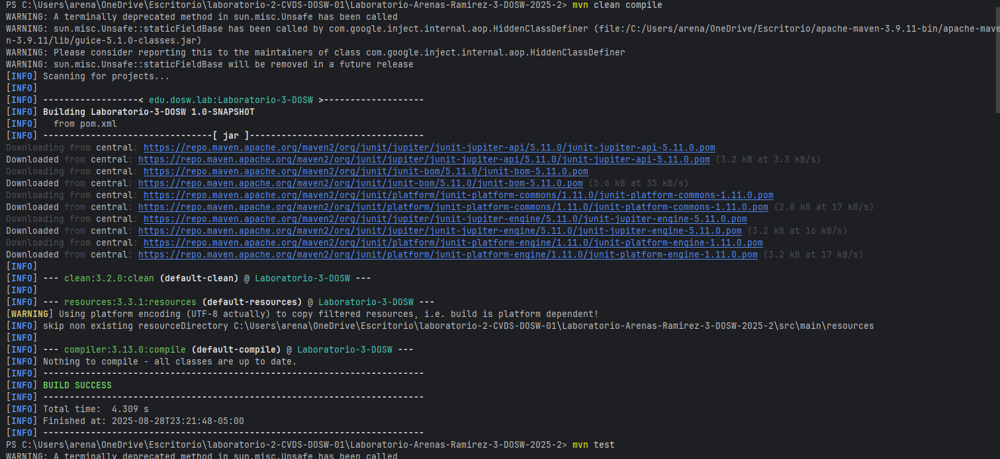

Compila con mvn test

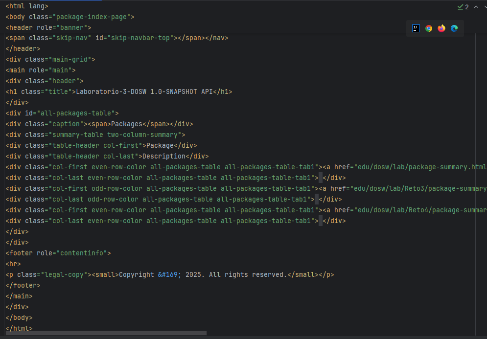
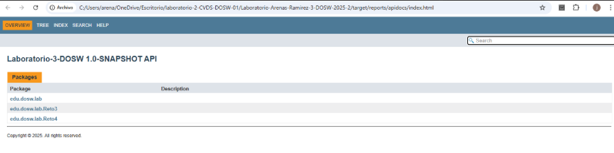
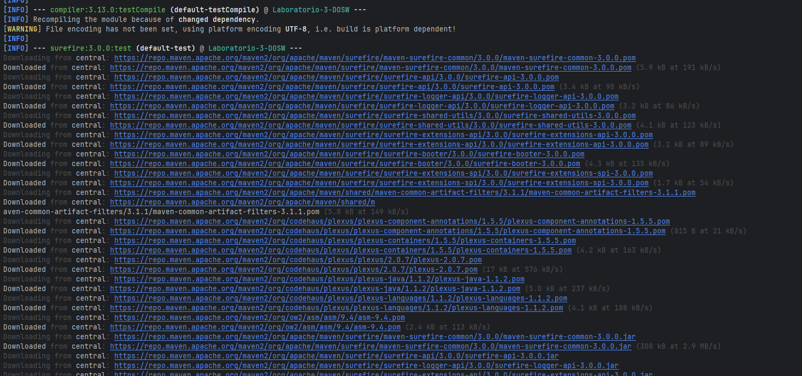

 
estudiante 2
----mvn clean compile
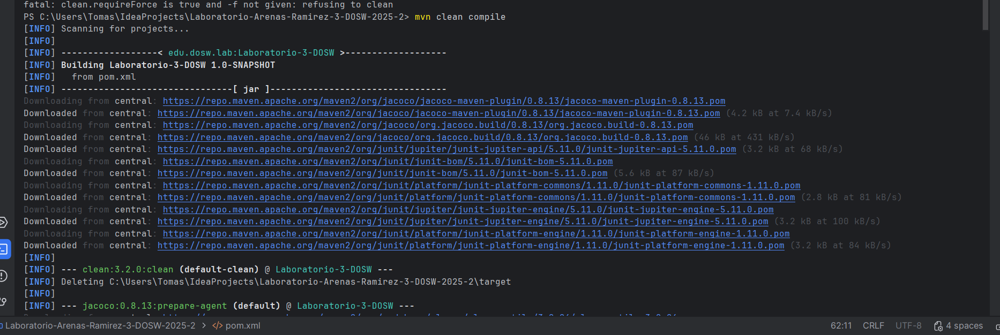
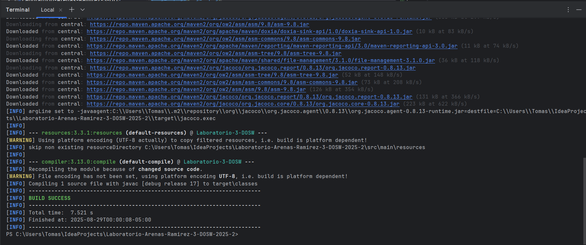
---- mvn test
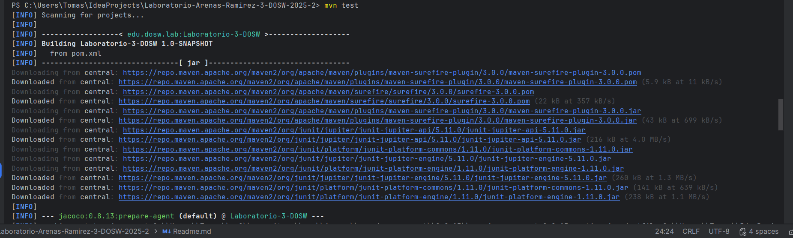
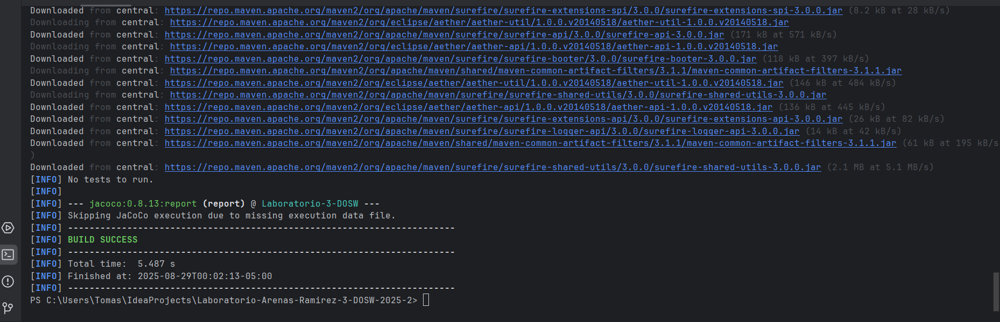

# Reto3

**Descripción*+

El reto consiste en implementar una simulación de votación para estimar las historias
de usuarios, usando la técnica de Planning Poker. En este caso los integrantes del 
equipo van a votar con los valores de la secuencia de Fibonacci, y dependiendo el 
resultado se podrán asignar puntos de esfuerzo a cada historia. 
El programa preguntara la cantidad de integrantes que hay, luego se va a pedir los 
votos, se validara que estén en la escala de Fibonacci, y revisara si todos los 
integrantes votaran igual para tener el mismo consenso, si no llegan a tener,
entonces se repetirá la votación hasta que lleguen todos a un acuerdo, por último se
mostrara el puntaje asignado de cada historia.

**Estructura**

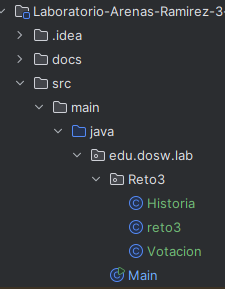}

**Las clases**

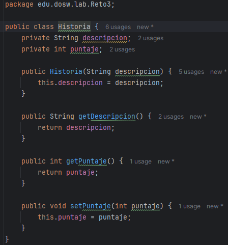
Esta clase representa una historia de usuario, que almacena las descripciones en un 
atributo y el puntaje estimado. 

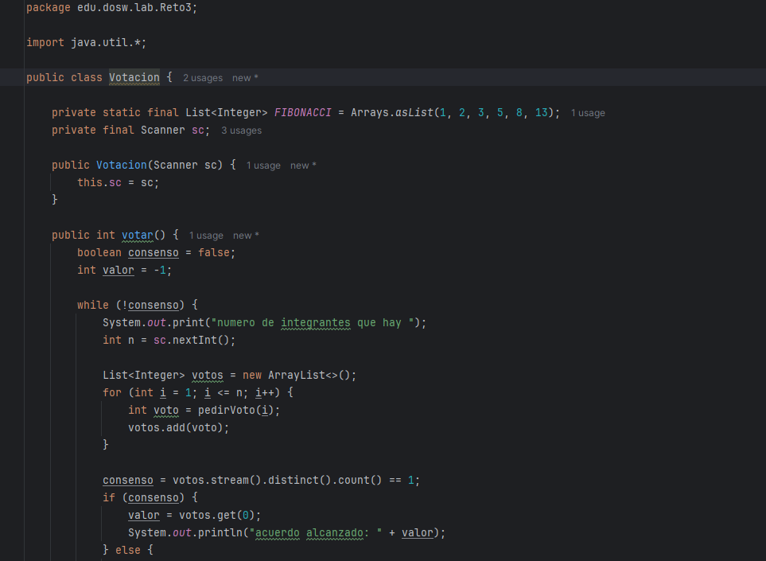
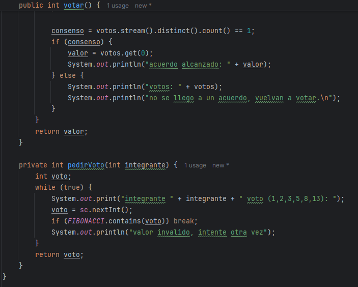
Esta clase es la que gestiona el proceso de votación, para poder estimar las historias
de usuario, donde se utiliza Fibonacci, como sus valores validos,

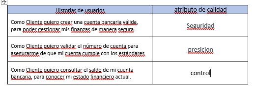
Esta clase ya es la que se encarga de ejecutar todo el proyecto de este reto, aca se inicia
creando la lista de las historias de usuario, comenzando con las votaciones y entregando
toda la evidencia de los votos y casos.

**Patrones**

- Singleton responsability
Ya que cada clase tiene una unica responsabilidad, como las historias que es almacenar los datos
de las historias y los puntajes, como votaciones que es la que organiza los votos,
y ya la reto3 que se encarga de coordinar todo el programa.
- Encapsulamiento
Se protegieron los datos con atributos privados.
- Agilismo
Se implementa directamente la tecnica Planning Poker, que se ve en el uso de historias d eusaurio
como unidad de trabajo, usando Fibonacci como estimacion de voto y tener un consenso para avanzar.

**Evidecia casos de usuario**

