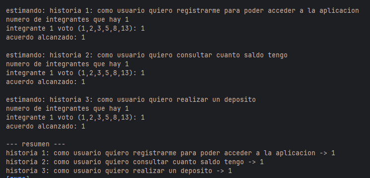

# LABORATORIO 3: TDD – Pruebas de Software – Agilismo y Scrum – Análisis de Requerimientos
**Integrantes**
- Julian Eduardo Arenas Alfonso
- Ramirez Alvarez Tomas Felipe

- **Grupo 2 DOSW**

**Nombre de la rama**
feature/laboratorio3_ramirez_arenas_2025-2

**Evidencias de que compilo**
compila con mvn clean compile

---------------------------
### Compila con mvn test

 
estudiante 2
----
### mvn clean compile

----
### mvn test

# Reto 1

Identifiquen reglas de negocio:
- Los números de cuenta deben tener exactamente 10 dígitos.
- Los dos primeros números corresponden a un banco registrado.
- No debe tener letras ni caracteres especiales las cuentas.
- El sistema debe permitir crear y validar las cuentas de los clientes.
- El sistema debe permitir consultar el saldo de una cuenta.
- El sistema debe permitir realizar depósitos a cuentas válidas.
**Descripción**

Definan las funcionalidades principales:
- Crear cuenta bancaria válida.
- Validar número de cuenta según reglas del negocio.
- Consultar saldo de una cuenta bancaria.
- Realizar depósito en una cuenta.
-Verificar que las cuentas esten en los bancos registrados.

Escriban los actores principales:
- **Cliente:** Persona que crea y gestiona cuentas bancarias.
- **Sistema:** Componente automático que gestiona las operaciones.
- **Administrador:** Verifica que los bancos esten registrados en el sistema.

Documenten las precondiciones necesarias para el sistema:
- Deben existir bancos válidos registrados en el sistema como por ejemplo 01 que es siendo Bancolombia y 02 que es davivienda y demas.
- El sistema debe tener persistencia  en memoria y base de datos para almacenar cuentas.
- Las cuentas deben crearse sólo si cumplen con las reglas de negocio.
- Debe existir un mecanismo para verificar que una cuenta es válida antes de realizar operaciones como consulta o depósito.

# reto 2 

- Diseñando A partir del punto anterior, su misión es la siguiente: 

- Realicen un diagrama de contexto de la solución (relaciones entre el sistema y los actores identificados) y explíquenlo

•Realicen un diagrama de Casos de uso en base a sus actores y las funcionalidades identificadas.

- En base al diagrama anterior generen historias de usuario basado en el formato: Como [actor], quiero [objetivo], para [beneficio] 
- Como Cliente quiero crear una cuenta bancaria válida, para poder gestionar mis finanzas de manera segura. 
- Como Cliente quiero validar el número de cuenta para asegurarme de que mi cuenta cumple con los estándares 
- Como Cliente quiero consultar el saldo de mi cuenta bancaria, para conocer mi estado financiero actual. 
- Como Cliente quiero realizar un depósito en mi cuenta, para incrementar mi saldo disponible.

- Generen una tabla de Excel con las historias de usuario creadas e indique para cada una que atributo de calidad resuelve.

- 

- •	Realicen un diagrama de Clases de las entidades identificadas en el enunciado.

- 

# Reto3

**Descripción**

El reto es simular una votación de Planning Poker para estimar el esfuerzo de las historias de usuario. El programa:

- Pregunta por el número de integrantes del equipo.

- Solicita los votos, que deben estar en la secuencia de Fibonacci.

- Valida que los votos sean unánimes para lograr un consenso.

- Si no hay consenso, se repite la votación.

- Al final, muestra los puntos de esfuerzo asignados a cada historia.

**Estructura**
- 

**Las clases**
- 

Esta clase representa una historia de usuario, que almacena las descripciones en un
atributo y el puntaje estimado.

- 
- 

Esta clase es la que gestiona el proceso de votación, para poder estimar las historias
de usuario, donde se utiliza Fibonacci, como sus valores validos,

- 

Esta clase ya es la que se encarga de ejecutar todo el proyecto de este reto, aca se inicia
creando la lista de las historias de usuario, comenzando con las votaciones y entregando
toda la evidencia de los votos y casos.

**Patrones**

- Singleton responsability
  Ya que cada clase tiene una unica responsabilidad, como las historias que es almacenar los datos
  de las historias y los puntajes, como votaciones que es la que organiza los votos,
  y ya la reto3 que se encarga de coordinar todo el programa.
- Encapsulamiento
  Se protegieron los datos con atributos privados.
- Agilismo
  Se implementa directamente la tecnica Planning Poker, que se ve en el uso de historias d eusaurio
  como unidad de trabajo, usando Fibonacci como estimacion de voto y tener un consenso para avanzar.

**Evidecia casos de usuario**

-
# Reto 4

**Sistema de Gestión de Cuentas Bancarias**
- Este proyecto es una aplicación Java que simula un sistema básico para la gestión de cuentas bancarias. 
Permite la creación de cuentas, la realización de transacciones y la consulta de saldos, demostrando principios de 
programación orientada a objetos (POO) y buenas prácticas de diseño de software.

**Características Principales**
- **Creación de Cuentas:** Permite generar nuevas cuentas bancarias asociadas a un cliente.
- **Gestión de Clientes:** Asocia cada cuenta a un cliente con su respectiva información.
- **Transacciones Seguras:** Implementa la lógica para realizar depósitos y retiros, con validación de saldo para evitar sobregiros.
- **Consulta de Saldo:** Permite a los usuarios verificar el saldo actual de sus cuentas.
- **Validación de Cuentas:** Incluye un validador para verificar la existencia de una cuenta antes de realizar operaciones.
- **Detalles de Transacción:** Genera un resumen detallado de cada transacción realizada.

**Funcionamiento logico**

Nuestras Clases estan dividad en dos partes la parte logica y la parte de prueva
la cual se encuentra en otra carpeta como se debe hacer con los requisitos de maven,
creamos las clases utilizando el diagrama del segundo reto para que todo estubiera trabajando
en conjunto bajo los mismos estandares y criterios:

- **ValidadorCuenta:** Verifica si una cuenta existe en el sistema.

- **Transaccion:** Realiza y registra operaciones bancarias como depósitos y retiros.

- **CuentaBancaria:** Almacena los detalles de una cuenta, incluyendo el saldo y el cliente.

- **Cliente:** Representa a la persona que posee una cuenta.

- **Banco:** Define los nombres y códigos de los bancos disponibles.

- **GestionCuentas:** Actúa como el controlador principal para crear, buscar y operar las cuentas.

-**Clases de pruba y su comportamiento**

- 

Se crearon las pruebas desde el funcionamiento mas basico para poder fomentar su informacion y comportamiento,
con el fin de satisfacer los retos solicitados.

# Reto 5

**Evidencia**

**Reflexion**

Para aumentar la cobertura, agregamos pruebas como el retiro con saldo insufucient. Esto nos permite
cubrir el error al lanzar una excepcion avisandonos que tenems saldo insuficiente.

Jacoco mostraba que esa condicion no estaba ejecutandose, pero gracias al test, ya se pudo superar 
correctamente la cobertura.

