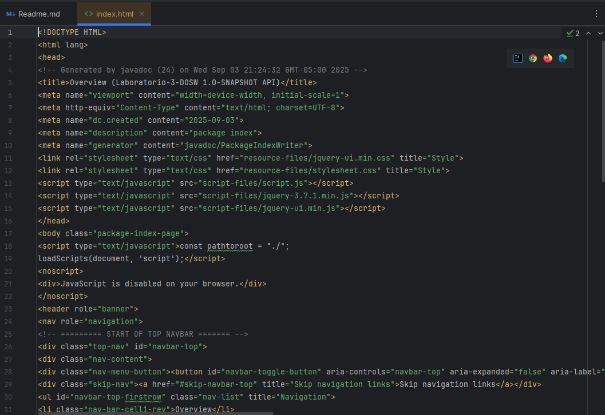
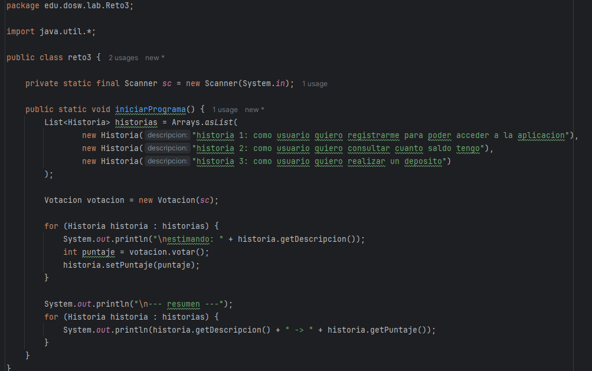

# LABORATORIO 3: TDD – Pruebas de Software – Agilismo y Scrum – Análisis de Requerimientos
**Integrantes**
- Julian Eduardo Arenas Alfonso
- Ramirez Alvarez Tomas Felipe

- **Grupo 2 DOSW**

**Nombre de la rama**
feature/laboratorio3_ramirez_arenas_2025-2

**Evidencias de que compilo**
compila con mvn clean compile

Compila con mvn test

 
estudiante 2
----mvn clean compile

---- mvn test

# Reto 1

Identifiquen reglas de negocio:
- Los números de cuenta deben tener exactamente 10 dígitos.
- Los dos primeros números corresponden a un banco registrado.
- No debe tener letras ni caracteres especiales las cuentas.
- El sistema debe permitir crear y validar las cuentas de los clientes.
- El sistema debe permitir consultar el saldo de una cuenta.
- El sistema debe permitir realizar depósitos a cuentas válidas.

Definan las funcionalidades principales:
- Crear cuenta bancaria válida.
- Validar número de cuenta según reglas del negocio.
- Consultar saldo de una cuenta bancaria.
- Realizar depósito en una cuenta.
-Verificar que las cuentas esten en los bancos registrados.

Escriban los actores principales:
- **Cliente:** Persona que crea y gestiona cuentas bancarias.
- **Sistema:** Componente automático que gestiona las operaciones.
- **Administrador:** Verifica que los bancos esten registrados en el sistema.

Documenten las precondiciones necesarias para el sistema:
- Deben existir bancos válidos registrados en el sistema como por ejemplo 01 que es siendo Bancolombia y 02 que es davivienda y demas.
- El sistema debe tener persistencia  en memoria y base de datos para almacenar cuentas.
- Las cuentas deben crearse sólo si cumplen con las reglas de negocio.
- Debe existir un mecanismo para verificar que una cuenta es válida antes de realizar operaciones como consulta o depósito.

# reto 2 
RETO #2: Diseñando A partir del punto anterior, su misión es la siguiente: 
•Realicen un diagrama de contexto de la solución (relaciones entre el sistema y los actores identificados) y explíquenlo

•Realicen un diagrama de Casos de uso en base a sus actores y las funcionalidades identificadas.

- En base al diagrama anterior generen historias de usuario basado en el formato: Como [actor], quiero [objetivo], para [beneficio] 
- Como Cliente quiero crear una cuenta bancaria válida, para poder gestionar mis finanzas de manera segura. 
- Como Cliente quiero validar el número de cuenta para asegurarme de que mi cuenta cumple con los estándares 
- Como Cliente quiero consultar el saldo de mi cuenta bancaria, para conocer mi estado financiero actual. 
- Como liente quiero realizar un depósito en mi cuenta, para incrementar mi saldo disponible. 

- Generen una tabla de Excel con las historias de usuario creadas e indique para cada una que atributo de calidad resuelve.
- 
- •	Realicen un diagrama de Clases de las entidades identificadas en el enunciado.
- 